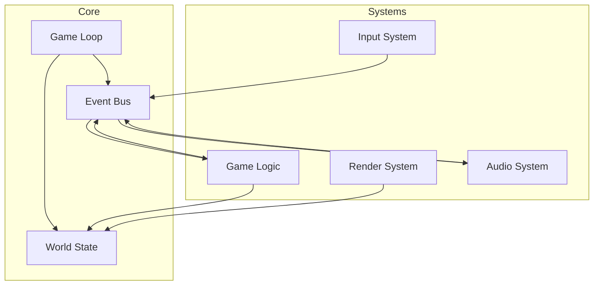

# 「Island Merge」改訂版設計書

## 1. 設計方針

### 1.1 コアコンセプト
- **段階的拡張**: MVP（最小構成）から始めて機能を追加
- **データ駆動**: ゲームロジックとデータの分離
- **イベント駆動**: 疎結合なシステム間通信
- **テスタビリティ**: ビジネスロジックの独立性確保

### 1.2 スコープ定義

| フェーズ | 内容 |
|---------|------|
| **MVP** | 基本的な島つなぎゲーム |
| **Phase 1** | アニメーション、音響、UI改善 |
| **Phase 2** | 複数ゲームモード、レベルエディタ |
| **Phase 3** | オンラインランキング機能、プロシージャル生成 |

---

## 2. シンプル化されたアーキテクチャ



---

## 3. 改善されたパッケージ構成

```
island-merge/
├── cmd/
│   └── game/
│       └── main.go         # エントリーポイント
├── pkg/
│   ├── core/              # ゲームのコア
│   │   ├── game.go        # メインゲームループ
│   │   ├── world.go       # ワールド状態管理
│   │   └── events.go      # イベントシステム
│   ├── island/            # ゲームロジック
│   │   ├── board.go       # ボード管理
│   │   ├── union_find.go  # Union-Find実装
│   │   └── rules.go       # ゲームルール定義
│   ├── systems/           # 各種システム
│   │   ├── input.go       # 入力処理
│   │   ├── render.go      # 描画処理
│   │   └── audio.go       # 音響処理
│   └── data/              # データ定義
│       ├── levels.go      # レベルデータ
│       └── config.go      # 設定構造体
├── assets/                # リソースファイル
│   ├── sprites/
│   ├── sounds/
│   └── levels/
└── web/                   # Wasm用ファイル
```

---

## 4. コア設計

### 4.1 イベントシステム

```go
// pkg/core/events.go
type EventType int

const (
    EventBridgeBuilt EventType = iota
    EventIslandsMerged
    EventGameWon
    EventGameReset
)

type Event interface {
    Type() EventType
    Data() interface{}
}

type EventBus struct {
    listeners map[EventType][]func(Event)
}

func (eb *EventBus) Subscribe(eventType EventType, handler func(Event)) {
    eb.listeners[eventType] = append(eb.listeners[eventType], handler)
}

func (eb *EventBus) Publish(event Event) {
    for _, handler := range eb.listeners[event.Type()] {
        handler(event)
    }
}
```

### 4.2 拡張可能なタイルシステム

```go
// pkg/island/board.go
type TileType uint8

const (
    TileEmpty TileType = iota
    TileLand
    TileSea
    TileBridge
    // 将来の拡張用
    TileObstacle
    TileSpecial
)

type Tile struct {
    Type       TileType
    Properties map[string]interface{} // 拡張用プロパティ
}

type Board struct {
    Width, Height int
    Tiles         []Tile
    UnionFind     *UnionFind
    Metadata      map[string]interface{} // レベル固有データ
}
```

### 4.3 ゲームステート管理

```go
// pkg/core/world.go
type GameMode int

const (
    ModeClassic GameMode = iota
    ModeTimeAttack
    ModePuzzle
    ModeSandbox
)

type World struct {
    Mode        GameMode
    Board       *island.Board
    Score       Score
    Config      *data.Config
    SaveState   *SaveData // セーブ/ロード用
}

type Score struct {
    Moves       int
    Time        time.Duration
    IslandsLeft int
    // 拡張用フィールド
    Combo       int
    BonusPoints int
}
```

---

## 5. 拡張性を考慮した機能設計

### 5.1 レベルシステム

```go
// pkg/data/levels.go
type LevelData struct {
    ID          string
    Name        string
    Width       int
    Height      int
    InitialMap  [][]TileType
    Objectives  []Objective
    Constraints Constraints
}

type Objective struct {
    Type        string // "connect_all", "min_bridges", "time_limit"
    Parameters  map[string]interface{}
}

type Constraints struct {
    MaxBridges  int
    TimeLimit   time.Duration
    SpecialRules []string
}

// JSONやYAMLから読み込み可能
func LoadLevel(path string) (*LevelData, error)
```

### 5.2 アニメーションシステム

```go
// pkg/systems/animation.go
type Animation struct {
    Frames    []image.Rectangle
    Duration  time.Duration
    Loop      bool
    OnComplete func()
}

type Animator struct {
    animations map[string]*Animation
    current    string
    elapsed    time.Duration
}

func (a *Animator) Play(name string)
func (a *Animator) Update(dt time.Duration)
func (a *Animator) CurrentFrame() image.Rectangle
```

---

## 6. 開発効率を高める機能

### 6.1 デバッグモード

```go
// pkg/core/debug.go
type DebugInfo struct {
    ShowFPS        bool
    ShowGrid       bool
    ShowUnionFind  bool
    EnableHotReload bool
}

func (g *Game) DrawDebug(screen *ebiten.Image) {
    if g.Debug.ShowFPS {
        ebitenutil.DebugPrint(screen, fmt.Sprintf("FPS: %0.2f", ebiten.CurrentFPS()))
    }
    if g.Debug.ShowUnionFind {
        g.drawUnionFindVisualization(screen)
    }
}
```

### 6.2 設定システム

```yaml
# assets/config.yaml
game:
  defaultMode: "classic"

graphics:
  tileSize: 32
  animationSpeed: 1.0
  
audio:
  masterVolume: 0.8
  enableSFX: true
  
debug:
  enabled: false
  showFPS: true
```

---

## 7. 段階的実装計画

### Phase 0: MVP
```
✓ 基本的なUnion-Find実装
✓ シンプルなボード表示
✓ クリックで橋を建設
✓ 勝利判定
```

### Phase 1: ポリッシュ
```
□ タイルアニメーション
□ 効果音追加
□ UIの改善
□ スコア表示
```

### Phase 2: 拡張機能
```
□ 複数ゲームモード
□ レベルエディタ
□ セーブ/ロード
□ 実績システム
```

---

## 8. テスト戦略の改善

```go
// island_test.go
func TestBoardScenarios(t *testing.T) {
    scenarios := []struct {
        name     string
        level    string
        actions  []Action
        expected Outcome
    }{
        {
            name:  "最小手数でクリア",
            level: "testdata/simple.json",
            actions: []Action{
                {Type: "bridge", X: 2, Y: 3},
                {Type: "bridge", X: 4, Y: 3},
            },
            expected: Outcome{Won: true, Moves: 2},
        },
    }
    // シナリオベースのテスト実行
}
```

---

## 9. パフォーマンス最適化

### 9.1 レンダリング最適化
- **ダーティフラグ**: 変更があったタイルのみ再描画
- **レイヤー分離**: 背景/タイル/UI/エフェクトを別レイヤーに
- **オブジェクトプール**: 頻繁に生成/破棄されるオブジェクトの再利用

### 9.2 大規模マップ対応
```go
type ChunkedBoard struct {
    ChunkSize int
    Chunks    map[ChunkID]*BoardChunk
    Viewport  Rectangle
}

// 視界内のチャンクのみ処理
func (cb *ChunkedBoard) UpdateVisible()
func (cb *ChunkedBoard) RenderVisible(screen *ebiten.Image)
```

---

## 10. まとめ

この改訂版設計では以下の改善を行いました：

1. **シンプル化**
   - パッケージ構成を整理し、責務を明確化
   - MVPから段階的に機能追加する方針

2. **拡張性向上**
   - イベントシステムによる疎結合化
   - データ駆動設計でコンテンツ追加が容易
   - 各種システムが独立して拡張可能

3. **開発効率**
   - デバッグ機能の充実
   - 設定の外部化
   - テストしやすい設計

4. **将来性**
   - 大規模マップへの対応準備
   - オンライン機能への拡張余地
   - モバイル対応の考慮